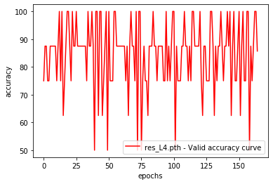
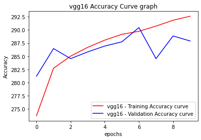

# MSDS19058_COVID19_DLSpring2020

__Objective:__
In this assignment we were required to detect infections of Coronavirus using X-Rays images. To do so, we were supposed to
•	Use CNN, pretrained ImageNet, to extract basic features from X-Ray images
•	Train classification layers in order to detect instance of Infected and Normal X-Ray Images
•	Fine-tune the entire network to try to improve performance

__Dataset:__ [link](https://drive.google.com/drive/u/0/folders/1-FzZhQO9oHIT9SNOWYoKsuz7fe447vtR)

The dataset contains 2 classes “infected” and “normal” and their details are as follow:

The X-Ray Images are taken in different vies (AP or PA) depending the side of the is facing the X-Ray scanner but we be using these images without considering their view. A few sample images:

__Task 1:__
In task 1 we were required to freeze all the layers except the FC layers and replace them with our designed Fc layers. Multiple tests have been performed by varying their learning rate, batch size and the results are as follows:

For Epoch = 5

Task 1

Training, validatioin, Testing confusion Matrices

Task 2

Training, validatioin, Testing confusion Matrices

Task 3

Training, validatioin, Testing confusion Matrices

Test Accuracy Validation Accuracy, F1

For Epoch =10

__Task 2:__
In task w we were required to freeze some and freeze none layer the layers of conv layers and replace pre-trained model FC layers with our designed FC layers. Multiple tests have been performed by varying their learning rate, batch size and the results are as follows:

The loss and accuracy curve for Resent18 Entire model training are as follow

For Epcoch = 5

Task 1

Training, validatioin, Testing confusion Matrices

Task 2

Training, validatioin, Testing confusion Matrices

Task 3

Training, validatioin, Testing confusion Matrices

Test Accuracy Validation Accuracy, F1

For Epoch =10

 
 

Please find the trained model of these assgienment on this link __Weights__ [link](https://drive.google.com/drive/folders/1bm45h4AL1S0H5-w_cLYkVQ8YPoWYD1VO?usp=sharing)

__PART 2__

For this part of the assignment we were supposed to train our VGG16 and Resnet 18 models for Multilabel Classification. We had to do mulitple experiments for Vgg16 and Resnet18 using BCEWithLogitsLoss and Focal Loss functions. Different experiments were performed by varing learning rate, batch size, epochs etc and Vgg16 performed outclass with highest training Accuracy(97.53%) and validation Accuracy(95.97%).

You can find the data [here](https://drive.google.com/file/d/1eytbwaLQBv12psV8I-aMkIli9N3bf8nO/view?usp=sharing)

Please find the Trained [Weights](https://drive.google.com/drive/folders/1uqHNmW48Pu7MbM7Yg2xsddOjy_I6ZT66?usp=sharing)
